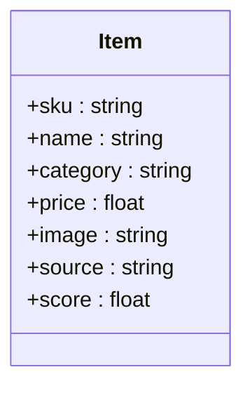
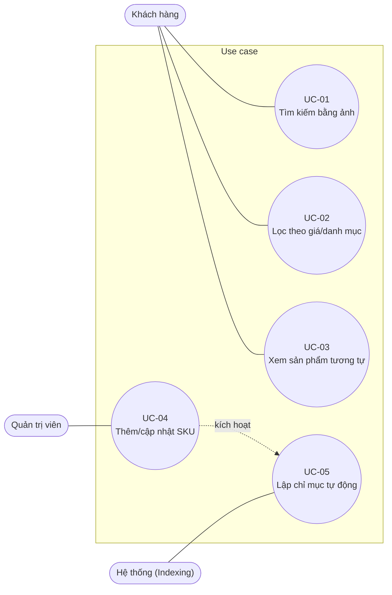
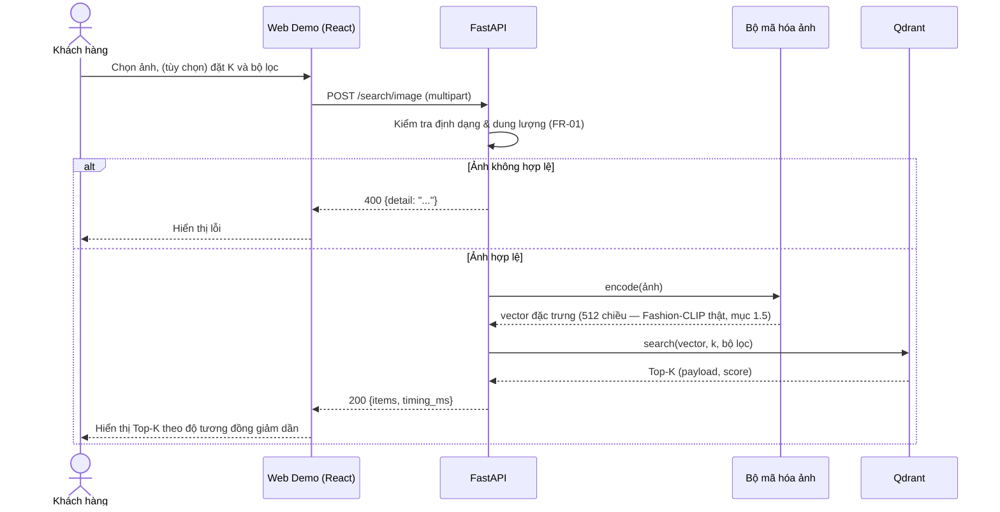
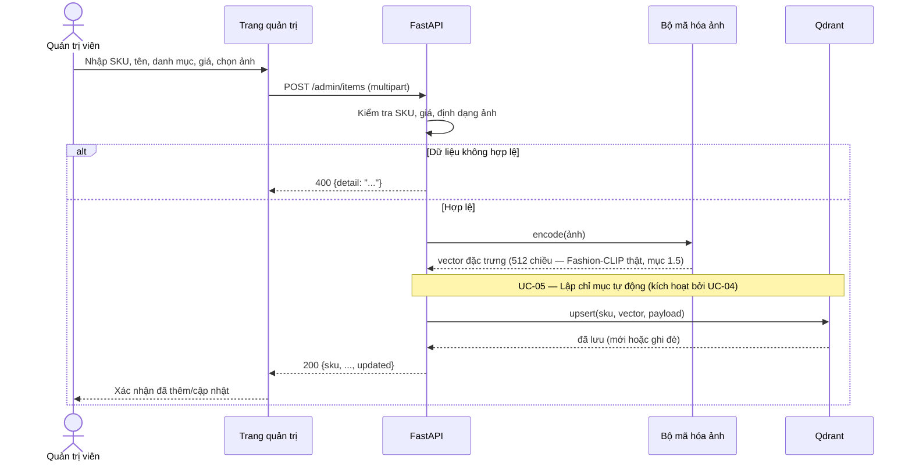

# Hệ thống Visual Search & Similar Items cho TMĐT Thời trang

**Đồ án môn Kỹ thuật phần mềm**

| Thông tin | Nội dung |
|---|---|
| Môn học | Kỹ thuật phần mềm |
| Giảng viên hướng dẫn | _(điền)_ |
| Sinh viên thực hiện | _(điền họ tên, MSSV)_ — làm cá nhân |
| Mô hình phát triển | Agile cá nhân (Scrum rút gọn, iteration 1 tuần) |
| Phiên bản tài liệu | 2.3 |

## Mục lục

- [Lịch sử thay đổi tài liệu](#lịch-sử-thay-đổi-tài-liệu)
- [Về bộ tài liệu và mã nguồn](#về-bộ-tài-liệu-và-mã-nguồn)
- [I. Giới thiệu đề tài](#i-giới-thiệu-đề-tài)
- [II. Kiến trúc tổng quan](#ii-kiến-trúc-tổng-quan)
- [III. Tác nhân và Use Case](#iii-tác-nhân-và-use-case)
- [IV. Yêu cầu chức năng (FR)](#iv-yêu-cầu-chức-năng-fr)
- [V. Yêu cầu phi chức năng (NFR)](#v-yêu-cầu-phi-chức-năng-nfr)
- [VI. Công cụ và Công nghệ sử dụng](#vi-công-cụ-và-công-nghệ-sử-dụng)
- [VII. Quy trình phát triển (Agile cá nhân)](#vii-quy-trình-phát-triển-agile-cá-nhân)
- [VIII. Sản phẩm bàn giao](#viii-sản-phẩm-bàn-giao)
- [IX. Kiểm thử và đảm bảo chất lượng](#ix-kiểm-thử-và-đảm-bảo-chất-lượng)
- [X. Quản lý rủi ro](#x-quản-lý-rủi-ro)
- [XI. Phân công](#xi-phân-công)
- [XII. Tài liệu tham khảo](#xii-tài-liệu-tham-khảo)
- [Phụ lục: Bảng thuật ngữ viết tắt](#phụ-lục-bảng-thuật-ngữ-viết-tắt)

## Lịch sử thay đổi tài liệu

| Phiên bản | Nội dung chính |
|---|---|
| 1.0 | Đặc tả ban đầu cho hệ thống Visual Search & Similar Items (định hướng sản phẩm TMĐT) |
| 2.0 | Điều chỉnh cho môn Kỹ thuật phần mềm; thu hẹp phạm vi cho một sinh viên thực hiện độc lập |
| 2.1 | Tách đề tài thành 3 phần nộp riêng cho 3 môn học (xem mục kế tiếp); bổ sung sơ đồ Mermaid (kiến trúc, mô hình dữ liệu, use case, sequence UC-01/UC-04); đặc tả chi tiết UC-04; gắn ma trận truy vết (mục IX) với bộ test thật đã chạy của backend; bổ sung mục lục, tài liệu tham khảo, bảng thuật ngữ |
| 2.2 | Chuyển Fashion-CLIP thật thành bộ mã hóa **chính thức** của hệ thống (không còn là mục tiêu dài hạn) — bổ sung mục 1.5 (thông số mô hình, mã tích hợp, lý do vẫn giữ bộ mã hóa dự phòng trong mã nguồn đã nộp); cập nhật kiến trúc, sequence diagram, FR-01, NFR-01/02, mục VI, VII, VIII, IX, X theo hướng Fashion-CLIP là chuẩn chính thức và bộ mã hóa mô phỏng là fallback |
| 2.3 (hiện tại) | Đổi tập dữ liệu catalog từ **DeepFashion In-shop Clothes Retrieval** (cần ký thỏa thuận sử dụng + gửi email trường/viện mới được cấp quyền tải, không tải ngay được) sang **Fashion Product Images (Small)** (Kaggle, tác giả Param Aggarwal — ~44.100 ảnh sản phẩm thời trang thật, tải công khai không cần xin quyền) — cập nhật mục 1.3, 1.4, V, IX, X, XII theo dataset mới; NFR-02 chuyển sang tự tách tập test query/gallery (nhóm theo `articleType`) vì dataset mới không có sẵn split chuẩn cho bài toán retrieval như DeepFashion |

## Về bộ tài liệu và mã nguồn

Đề tài được nộp thành ba phần độc lập cho ba môn học:

1. **Kỹ thuật phần mềm** (tài liệu này) — đặc tả yêu cầu, thiết kế, quy trình, kiểm thử,
   quản lý rủi ro. Không kèm mã nguồn.
2. **Xây dựng ứng dụng web (Front-end)** — bản demo React (Vite), chạy hoàn toàn phía client
   (không có backend), bộ mã hóa ảnh mô phỏng chạy bằng Canvas API trong trình duyệt.
3. **Thiết kế web nâng cao (Full-stack)** — dùng lại đúng giao diện và component của bản
   Front-end, ghép với backend FastAPI + Qdrant Vector Database thật, đóng gói bằng Docker
   Compose. Khác biệt giữa hai phần là *front-end độc lập* so với *full-stack có API thật*,
   không phải khác biệt về công nghệ front-end (cả hai đều dùng React + Vite).

Tài liệu này mô tả đề tài như một tổng thể; các FR/NFR, use case và ma trận truy vết ở
dưới áp dụng chung cho cả hai phần cài đặt (2) và (3), dù mỗi phần chỉ hiện thực một phần
phạm vi phù hợp với môn học của nó (phần (2) chỉ có front-end, không có máy chủ thật).

## I. Giới thiệu đề tài

### 1.1 Bối cảnh và vấn đề

Tìm kiếm bằng từ khóa (Text Search) trong thời trang gặp rào cản do ngôn ngữ mô tả kiểu
dáng, họa tiết mang tính trừu tượng. Người dùng có nhu cầu tìm sản phẩm bằng hình ảnh thực
tế hoặc ảnh từ mạng xã hội.

### 1.2 Mục tiêu

* **Mục tiêu sản phẩm:** Xây dựng hệ thống tìm kiếm bằng ảnh (**Visual Search**) và gợi ý
  sản phẩm tương tự (**Similar Items**) cho website TMĐT thời trang, ứng dụng mô hình
  **Fashion-CLIP** và **Qdrant Vector DB**.
* **Mục tiêu môn học:** Áp dụng quy trình kỹ thuật phần mềm từ đầu đến cuối trên một sản
  phẩm cụ thể: đặc tả yêu cầu, thiết kế bằng UML, lập trình theo vòng lặp Agile, kiểm thử
  tự động, CI/CD và quản lý rủi ro.

### 1.3 Phạm vi

* **In-scope:** Tiền xử lý tập dữ liệu Fashion Product Images (Small), xây dựng RESTful API,
  lưu trữ Vector DB, dựng Web Demo thử nghiệm.
* **Out-of-scope:** Giỏ hàng, thanh toán, vận chuyển, quản lý tài khoản người dùng.

### 1.4 Ràng buộc và giả định

* Thực hiện cá nhân trong thời gian của học phần, nên phạm vi được quản lý theo ưu tiên
  MoSCoW (mục IV): chỉ các yêu cầu **Must** là bắt buộc.
* Dữ liệu chính là **Fashion Product Images (Small)** (Kaggle, tác giả Param Aggarwal —
  ~44.100 ảnh sản phẩm thời trang thật, có nhãn `articleType`/`baseColour`, tải công khai
  không cần xin quyền truy cập); danh mục hiển thị của sản phẩm ánh xạ từ trường `articleType`
  có sẵn trong tập dữ liệu, giá là dữ liệu giả lập vì tập dữ liệu không có giá.
* **Bộ mã hóa ảnh chính thức của hệ thống là Fashion-CLIP thật** (ViT-B/32, vector 512
  chiều — mục 1.5), tích hợp ở backend Phần 3. Mã nguồn đã đóng gói nộp kèm đề tài (Phần 2,
  3) hiện chạy bằng bộ mã hóa dự phòng (mô phỏng, không học máy) vì môi trường soạn thảo tài
  liệu và mã nguồn này không tải/cài được PyTorch và trọng số mô hình — xem mục 1.5 để biết
  chi tiết tích hợp, và mục X (rủi ro).
* Hệ thống là bản demo học tập, chưa có xác thực người dùng; chức năng Admin được thực hiện
  qua API/giao diện nội bộ, không có phân quyền.

### 1.5 Tích hợp Fashion-CLIP thật (bộ mã hóa chính thức)

**Fashion-CLIP thật là bộ mã hóa ảnh chính thức của hệ thống** — không còn là "mục tiêu dài
hạn" như các bản tài liệu trước. Thông số mô hình (nguồn: [model card trên Hugging
Face](https://huggingface.co/patrickjohncyh/fashion-clip) và [repo GitHub của tác
giả](https://github.com/patrickjohncyh/fashion-clip)):

| Thuộc tính | Giá trị |
|---|---|
| Kiến trúc nền | CLIP ViT-B/32 (huấn luyện tiếp từ checkpoint LAION) |
| Chiều vector embedding | 512 |
| Dữ liệu huấn luyện | ~800K sản phẩm thời trang từ Farfetch, hơn 3.000 thương hiệu |
| Số tham số | ~0,2 tỷ (200 triệu) |
| Kích thước tải về | Khoảng 400–500 MB (tùy định dạng lưu trữ trọng số) |
| Giấy phép | MIT |
| Kích thước ảnh đầu vào | 224×224 (bộ tiền xử lý của mô hình tự resize) |

**Cách tích hợp** — dùng gói `fashion-clip` chính thức của tác giả (đơn giản hơn tự ghép
`transformers` + `CLIPModel`, vì đã đóng gói sẵn bước tiền xử lý và có sẵn hàm mã hóa hàng
loạt):

```python
# requirements.txt: fashion-clip, torch
from fashion_clip.fashion_clip import FashionCLIP
import numpy as np

fclip = FashionCLIP("fashion-clip")   # tải trọng số lần đầu — cần mạng

def encode_image(pil_image) -> np.ndarray:
    vec = fclip.encode_images([pil_image], batch_size=1)[0]
    return vec / np.linalg.norm(vec)   # chuẩn hóa L2 — đúng quy ước của bộ mã hóa dự phòng
```

Điểm tích hợp trong mã nguồn chỉ nằm ở hàm mã hóa của backend Phần 3
(`app/core/encoder.py`) — phần còn lại của kiến trúc (API, Qdrant, front-end) **không cần
đổi**, vì mọi nơi khác chỉ phụ thuộc vào hợp đồng "ảnh → vector đã chuẩn hóa L2", đúng theo
điểm cắm bộ mã hóa đã thiết kế sẵn (kiến trúc, mục II).

**Vì sao vẫn giữ bộ mã hóa dự phòng (fallback) trong mã nguồn đã nộp:**

* Fashion-CLIP cần PyTorch (cài đặt nặng, khoảng 1–2 GB) và tải trọng số mô hình
  (~400–500 MB). Môi trường dùng để soạn tài liệu và mã nguồn cho đề tài này **bị chặn truy
  cập PyPI/mạng ngoài** (đã xác nhận khi thử cài `fastapi`/`qdrant-client`, xem README phần
  Full-stack) — nên không thể cài đặt, tải mô hình hay chạy thử Fashion-CLIP thật ở đó.
* Vì vậy mã nguồn đóng gói nộp kèm đề tài (Phần 2, 3) vẫn chạy bằng bộ mã hóa dự phòng, xử lý
  ảnh bằng các phép toán thống kê đơn giản, không học máy (histogram màu RGB 64 chiều + lưới
  hình dáng 16 chiều + năng lượng gradient theo hướng 8 chiều = vector 88 chiều, chuẩn hóa
  L2). Đây là **bản demo chạy được ngay, đã kiểm thử thật** (32 test PASS, mục IX) — không
  phải bản trống. Thay bằng lệnh gọi Fashion-CLIP thật ở trên là một thay đổi cục bộ, sinh
  viên tự thực hiện trên máy có mạng/GPU trước khi báo cáo.
* Bộ mã hóa dự phòng cũng có giá trị lâu dài: cho phép chạy demo/chấm bài ngay cả khi không
  có GPU hoặc mất mạng tạm thời — một lựa chọn thiết kế hợp lý (graceful degradation), không
  phải một hạn chế cần xóa bỏ.

**Ảnh hưởng tới các mục khác của tài liệu:** vector lưu trong Qdrant chuyển từ 88 chiều (dự
phòng) sang 512 chiều (Fashion-CLIP) khi tích hợp thật — cấu hình `VECTOR_DIM` trong
`backend/app/config.py` cần đổi theo; độ trễ mã hóa (NFR-01) và độ chính xác (NFR-02) áp dụng
trực tiếp cho Fashion-CLIP kể từ bản tài liệu này, không còn là "mục tiêu tương lai" — xem
thêm rủi ro liên quan ở mục X.

### 1.6 Các bên liên quan

| Bên liên quan | Mối quan tâm |
|---|---|
| Khách hàng (Shopper) | Tìm đúng sản phẩm nhanh bằng ảnh, xem gợi ý tương tự |
| Quản trị viên (Admin) | Thêm/cập nhật SKU dễ dàng, dữ liệu tìm kiếm luôn đồng bộ |
| Giảng viên | Đóng vai khách hàng/Product Owner: nghiệm thu theo tiêu chí ở mục III–IV |
| Sinh viên thực hiện | Tự đảm nhiệm mọi vai trò: phân tích, thiết kế, lập trình, kiểm thử, vận hành |

## II. Kiến trúc tổng quan

Sơ đồ dưới mô tả kiến trúc mục tiêu (áp dụng đầy đủ ở phần Full-stack; phần Front-end chỉ
có khối bên trái, tự mô phỏng khối mã hóa/tìm kiếm ngay trong trình duyệt vì không có máy
chủ):


| Thành phần | Vai trò |
|---|---|
| Web Demo | Upload ảnh, hiển thị Top-K, bộ lọc giá/danh mục, trang chi tiết sản phẩm với mục "Sản phẩm tương tự", trang quản trị |
| API (FastAPI) | Kiểm tra/chuẩn hóa ảnh (FR-01), điều phối mã hóa + truy vấn, ghép kết quả trả về client |
| Bộ mã hóa ảnh | Sinh vector đặc trưng từ ảnh (xem mục 1.5) |
| Qdrant | Lưu vector + metadata (SKU, tên, giá, danh mục), tìm kiếm ANN bằng HNSW, lọc theo metadata |

Ở bản Front-end (môn Xây dựng ứng dụng web), toàn bộ kiến trúc trên rút gọn còn đúng khối
**Web Demo**: front-end tự đảm nhiệm luôn vai trò của Bộ mã hóa ảnh (bằng Canvas API) và
Qdrant (bằng tìm kiếm tuyến tính trong bộ nhớ), không có khối Server và Qdrant thật.

### Mô hình dữ liệu (Item)

Một sản phẩm được trả về từ API có cấu trúc như sau (khớp với `schemas.py` ở bản cài đặt
Full-stack):



`score` chỉ có giá trị khi `Item` là một kết quả tìm kiếm/gợi ý (`/search/image`,
`/items/{sku}/similar`); vắng mặt khi duyệt danh mục thường (`/items`). Vector đặc trưng
(512 chiều với Fashion-CLIP thật, hoặc 88 chiều với bộ mã hóa dự phòng — mục 1.5) được lưu
kèm trong Qdrant nhưng không trả về qua API — chỉ dùng nội bộ để so khớp.

Chi tiết từng luồng xử lý (xem sequence diagram của UC-01, UC-04 ở mục III) và thiết kế
collection trong Qdrant được mô tả đầy đủ trong README của phần Full-stack, kèm mã nguồn thật.

## III. Tác nhân và Use Case

**Tác nhân:** Khách hàng, Quản trị viên, Hệ thống (Indexing).



Mũi tên nét đứt UC-04 → UC-05 thể hiện quan hệ tương tự `<<include>>` trong UML: mỗi lần
thêm/cập nhật SKU thành công đều tự động kích hoạt việc lập chỉ mục, không phải hai thao tác
tách rời.

| Mã | Use case | Tác nhân chính | FR liên quan |
|---|---|---|---|
| UC-01 | Tìm kiếm sản phẩm bằng ảnh | Khách hàng | FR-01, FR-02 |
| UC-02 | Lọc kết quả theo giá/danh mục | Khách hàng | FR-04 |
| UC-03 | Xem sản phẩm tương tự tại trang chi tiết | Khách hàng | FR-03 |
| UC-04 | Thêm/cập nhật SKU vào danh mục | Quản trị viên | FR-05 |
| UC-05 | Lập chỉ mục vector tự động | Hệ thống | FR-05 |

### Đặc tả chi tiết: UC-01 Tìm kiếm sản phẩm bằng ảnh

| Mục | Nội dung |
|---|---|
| Tác nhân | Khách hàng |
| Tiền điều kiện | Danh mục sản phẩm đã được lập chỉ mục |
| Luồng chính | 1. Khách hàng chọn ảnh từ thiết bị và (tùy chọn) đặt số kết quả K. 2. Hệ thống kiểm tra định dạng và dung lượng ảnh. 3. Hệ thống chuẩn hóa ảnh và tìm K sản phẩm giống nhất. 4. Hệ thống hiển thị danh sách kết quả theo độ tương đồng giảm dần. |
| Luồng thay thế | 2a. Ảnh sai định dạng hoặc quá dung lượng: hệ thống báo lỗi rõ ràng, khách hàng chọn ảnh khác. 3a. Danh mục rỗng hoặc không có kết quả: hệ thống thông báo không tìm thấy sản phẩm phù hợp. 3b. Khách hàng đặt bộ lọc: chuyển sang UC-02. |
| Hậu điều kiện | Khách hàng thấy danh sách sản phẩm phù hợp hoặc thông báo lỗi/không có kết quả |



### Đặc tả chi tiết: UC-04 Thêm/cập nhật SKU vào danh mục

| Mục | Nội dung |
|---|---|
| Tác nhân | Quản trị viên |
| Tiền điều kiện | Quản trị viên truy cập được trang/API quản trị (đồ án demo, chưa có xác thực — mục 1.4) |
| Luồng chính | 1. Quản trị viên nhập mã SKU, tên, danh mục, giá và chọn ảnh sản phẩm. 2. Hệ thống kiểm tra định dạng dữ liệu (mã SKU, giá, định dạng/dung lượng ảnh). 3. Hệ thống mã hóa ảnh thành vector đặc trưng. 4. Hệ thống lưu (hoặc ghi đè) bản ghi vào Qdrant — kích hoạt UC-05. 5. Hệ thống xác nhận thành công cho quản trị viên. |
| Luồng thay thế | 2a. Dữ liệu không hợp lệ (SKU sai định dạng, giá âm, ảnh sai định dạng/quá dung lượng): hệ thống báo lỗi cụ thể, không lưu. 4a. SKU đã tồn tại: hệ thống ghi đè bản ghi cũ (cập nhật), không tạo bản sao — phản hồi kèm cờ `updated = true`. |
| Hậu điều kiện | Sản phẩm tìm kiếm được ngay trong lần truy vấn kế tiếp, không cần thao tác lập chỉ mục thủ công |



## IV. Yêu cầu chức năng (FR)

Ưu tiên theo MoSCoW: **M** = Must, **S** = Should, **C** = Could.

### 4.1 User story (Product Backlog ban đầu)

| Mã | User story | FR | Ưu tiên |
|---|---|---|---|
| US-01 | Là khách hàng, tôi muốn tải lên ảnh một món đồ để tìm các sản phẩm giống nó | FR-01, FR-02 | M |
| US-02 | Là khách hàng, tôi muốn xem sản phẩm tương tự khi đang xem một sản phẩm | FR-03 | M |
| US-03 | Là quản trị viên, tôi muốn sản phẩm mới thêm vào tự động tìm kiếm được | FR-05 | M |
| US-04 | Là khách hàng, tôi muốn lọc kết quả theo giá và danh mục | FR-04 | S |

### 4.2 Bảng yêu cầu

| Mã | Yêu cầu | Ưu tiên | Tiêu chí chấp nhận |
|---|---|---|---|
| **FR-01** Upload & Preprocessing | Upload ảnh `.jpg`, `.png`, kiểm tra định dạng và chuẩn hóa kích thước | M | Từ chối file sai định dạng hoặc lớn hơn 5 MB (có thể cấu hình) kèm thông báo lỗi rõ ràng; ảnh hợp lệ được chuẩn hóa về kích thước đầu vào của mô hình (224×224 với Fashion-CLIP thật, mục 1.5) |
| **FR-02** Visual Search | Trả về Top-K sản phẩm giống nhất với ảnh người dùng upload | M | K mặc định là 10, tối đa 50; kết quả sắp xếp giảm dần theo độ tương đồng; mỗi kết quả có mã SKU, tên, giá, ảnh, điểm tương đồng |
| **FR-03** Similar Items | Hiển thị sản phẩm cùng kiểu dáng tại trang chi tiết sản phẩm (PDP) | M | Danh sách gợi ý không chứa chính sản phẩm đang xem |
| **FR-04** Attribute Filtering | Kết hợp Vector Search với bộ lọc khoảng giá/danh mục | S | Mọi kết quả trả về thỏa bộ lọc đã chọn; bộ lọc không khớp sản phẩm nào thì trả về danh sách rỗng |
| **FR-05** Catalog Indexing | Tự động trích xuất vector và cập nhật vào DB khi Admin thêm SKU mới | M | SKU mới tìm được trong kết quả tìm kiếm ngay sau khi thêm; thêm lại cùng SKU cập nhật bản ghi cũ, không tạo bản sao |

## V. Yêu cầu phi chức năng (NFR)

Điều kiện đo NFR-01 và NFR-03: chạy trên máy demo với danh mục $100.000+$ vector; ghi rõ
cấu hình phần cứng trong báo cáo.

| Mã | Yêu cầu | Chỉ tiêu | Cách kiểm chứng |
|---|---|---|---|
| **NFR-01** Latency | Độ trễ phản hồi | API End-to-End $< 300\text{ms}$; vector query tại DB $< 50\text{ms}$ (mã hóa bằng Fashion-CLIP thật trên GPU; trên CPU độ trễ mã hóa có thể cao hơn đáng kể — xem rủi ro mục X) | Đo bằng test hiệu năng, báo cáo p50/p95 |
| **NFR-02** Accuracy | Độ chính xác truy hồi | $Recall@10 \ge 80\%$ trên tập test tự tách từ Fashion Product Images (Small) (nhóm theo `articleType`, vì dataset này không có sẵn split query/gallery chuẩn cho bài toán retrieval như DeepFashion), đo với **Fashion-CLIP thật** (bộ mã hóa chính thức, mục 1.5) — bộ mã hóa dự phòng trong mã nguồn đã nộp không nhắm đạt ngưỡng này, xem mục X | Script đánh giá tự tách query/gallery từ Fashion Product Images (Small), xem mục IX |
| **NFR-03** Scalability | Khả năng mở rộng | $100.000+$ vector, $RPS \ge 50$ | Load test (Locust) với vector giả lập bổ sung cho đủ số lượng |
| **NFR-04** Deployability | Khả năng triển khai | Toàn bộ hệ thống (phần Full-stack) chạy bằng `docker-compose up` | Triển khai thử trên máy sạch |
| **NFR-05** Maintainability | Khả năng bảo trì | Độ phủ unit test $\ge 70\%$ cho module lõi (validate, filter, API), code qua linter | Báo cáo coverage trong CI |

## VI. Công cụ và Công nghệ sử dụng

* **AI — bộ mã hóa chính thức:** Fashion-CLIP thật (`ViT-B/32`, vector 512 chiều,
  `patrickjohncyh/fashion-clip`) — xem mục 1.5 để biết thông số và cách tích hợp.
* **AI — bộ mã hóa dự phòng (fallback trong mã nguồn đã nộp):** bộ mã hóa mô phỏng 88
  chiều, không học máy — xem mục 1.5.
* **Dataset:** Fashion Product Images (Small) (Kaggle, tác giả Param Aggarwal, ~44.100 ảnh).
* **Backend & Storage:** Python 3.11+, FastAPI, Qdrant Vector Database (chỉ mục HNSW).
* **Front-end:** React + Vite — bản độc lập chạy phía client (môn Front-end) và bản gọi API
  thật (môn Full-stack) dùng chung giao diện, chỉ khác lớp gọi dữ liệu.
* **DevOps:** Docker & Docker Compose.
* **Công cụ kỹ thuật phần mềm:**
  * Quản lý mã nguồn: Git + GitHub, nhánh `main` / `feature/*`, commit theo quy ước (ví dụ
    `feat:`, `fix:`, `docs:`, `test:`), làm việc qua Pull Request (tự review theo checklist)
  * Quản lý công việc: GitHub Projects (Kanban: Backlog → Doing → Done)
  * Kiểm thử: `pytest`, `httpx`/`TestClient` (backend), test thuần Python cho phần lõi
  * CI/CD: GitHub Actions (lint, test, build Docker image)
  * Thiết kế UML: draw.io hoặc PlantUML

## VII. Quy trình phát triển (Agile cá nhân)

Làm một mình nên dùng Scrum rút gọn thay vì đủ các vai trò và nghi thức của nhóm:

* **Product Backlog:** các user story ở mục 4.1, xếp theo ưu tiên MoSCoW, được chia nhỏ
  thành task trên bảng Kanban.
* **Iteration 1 tuần:** đầu tuần chọn story vào Sprint Backlog; cuối tuần tự đánh giá
  (Review) và ghi lại điều cần cải thiện (Retrospective) vào `docs/sprint-log.md`.
* **Product Owner:** giảng viên; báo cáo tiến độ và xin phản hồi định kỳ.
* **Definition of Done:** code được merge qua Pull Request, có unit test và qua CI, đáp ứng
  tiêu chí chấp nhận, tài liệu liên quan được cập nhật.
* **Theo dõi tiến độ:** biểu đồ burndown đơn giản hoặc bảng story hoàn thành theo tuần.

| Iteration | Trọng tâm |
|---|---|
| 0 | Đặc tả yêu cầu (SRS — tài liệu này), dựng repo, môi trường, CI cơ bản, vẽ Use Case |
| 1 | Front-end React (Vite), chạy phía client + bộ mã hóa mô phỏng (môn Front-end) |
| 2 | Backend FastAPI + Qdrant, các API Visual Search/Similar Items/Admin (FR-02, FR-03, FR-05); tích hợp Fashion-CLIP thật ở điểm cắm bộ mã hóa (mục 1.5) |
| 3 | Front-end React ghép với API thật, bộ lọc thuộc tính (FR-04), đóng gói Docker Compose |
| 4 | Đo hiệu năng và độ chính xác, hoàn thiện tài liệu, chuẩn bị bảo vệ |

_Số iteration có thể điều chỉnh theo thời gian thực tế của học phần._

## VIII. Sản phẩm bàn giao

1. **Tài liệu đặc tả yêu cầu (SRS)** — tài liệu này.
2. **Mô hình hóa UML:** Use Case (mục III), Sequence (cho UC-01, UC-04), ER/Class — bổ
   sung sơ đồ vẽ tay/draw.io khi báo cáo.
3. **Mã nguồn Front-end** — nộp riêng cho môn Xây dựng ứng dụng web.
4. **Mã nguồn Full-stack** (front-end + backend + `docker-compose.yml`) — nộp riêng cho môn
   Thiết kế web nâng cao.
5. **Kế hoạch và báo cáo kiểm thử**, gồm ma trận truy vết yêu cầu (mục IX).
6. **Báo cáo đánh giá** độ chính xác (Recall@10) và hiệu năng (latency, RPS) đo với
   Fashion-CLIP thật (bộ mã hóa chính thức, mục 1.5); nếu môi trường chạy thử không có
   mạng/GPU, báo cáo số liệu đo được trên bộ mã hóa dự phòng kèm ghi chú rõ ràng.
7. **Nhật ký dự án:** backlog, sprint log, lịch sử commit/Pull Request.
8. **Slide và demo** bảo vệ đồ án.

## IX. Kiểm thử và đảm bảo chất lượng

| Mức | Nội dung | Công cụ |
|---|---|---|
| Unit test | Validate ảnh, tiền xử lý, hàm mã hóa, hàm lọc | `pytest` / test thuần Python |
| Integration test | API ↔ mã hóa ↔ Qdrant (Qdrant chạy trong container) | `pytest`, `httpx` |
| Kiểm thử chức năng | Kiểm tra từng tiêu chí chấp nhận của FR-01…FR-05 | `pytest`, kiểm thử thủ công |
| Kiểm thử hiệu năng | Latency p50/p95, RPS trên tập $100.000+$ vector | Locust |
| Đánh giá mô hình | Recall@10 trên tập test tự tách từ Fashion Product Images (Small), đo với Fashion-CLIP thật (bộ mã hóa chính thức, mục 1.5) | Script đánh giá riêng |
| Kiểm thử chấp nhận | Nhờ 3–5 người dùng thử theo kịch bản UC-01…UC-04 | Bảng khảo sát ngắn |

Mọi Pull Request phải qua CI (lint + test) trước khi merge vào `main`.

**Ma trận truy vết yêu cầu:**

Cột "Kiểm thử" trích tên lớp/hàm test thật trong `backend/tests/` của bản Full-stack.
**"Đã chạy: PASS"** nghĩa là test đã được thực thi thật (không chỉ viết sẵn) — xem mục
"Giới hạn môi trường phát triển" trong README của phần Full-stack để biết chính xác phần
nào đã chạy được và phần nào cần tự chạy lại.

| Yêu cầu | User story | Use case | Kiểm thử |
|---|---|---|---|
| FR-01 | US-01 | UC-01 | `ValidateTests` (8 test) — `test_core.py`, **đã chạy: PASS**; `test_search_rejects_bad_file_type` — `test_api.py` |
| FR-02 | US-01 | UC-01 | `SearchTests.test_top_k_orders_by_similarity`, `test_k_caps_result_count` — `test_core.py`, **đã chạy: PASS**; `test_search_by_image_returns_ranked_results` — `test_api.py` |
| FR-03 | US-02 | UC-03 | `SearchTests.test_exclude_sku` — `test_core.py`, **đã chạy: PASS**; `test_similar_items_excludes_itself` — `test_api.py` |
| FR-04 | US-04 | UC-02 | `SearchTests.test_category_filter`, `test_price_range_filter` — `test_core.py`, **đã chạy: PASS** |
| FR-05 | US-03 | UC-04, UC-05 | `MemoryStoreTests.test_upsert_then_get`, `test_upsert_twice_reports_updated` — `test_core.py`, **đã chạy: PASS**; `test_admin_upsert_then_delete` — `test_api.py` |
| NFR-01, 03 | — | — | Locust (chưa thực hiện — xem mục X, rủi ro "Thiếu tài nguyên tính toán") |
| NFR-02 | — | — | Script đánh giá Recall@10, chạy với Fashion-CLIP thật (bộ mã hóa chính thức — xem mục 1.5; chưa chạy được trong môi trường soạn thảo, xem mục X) |
| NFR-04 | — | — | `docker-compose up` — `docker-compose.yml` viết sẵn; build/chạy thật cần tự thực hiện (không có Docker daemon trong môi trường soạn thảo) |
| NFR-05 | — | — | 32/32 test `test_core.py` **PASS**; không lỗi tĩnh khi quét bằng `ruff check --select=F,E9` trên toàn bộ mã backend |

`test_api.py` (kiểm thử qua HTTP thật, dùng `fastapi.testclient.TestClient`) đã được viết đầy
đủ nhưng chưa chạy được trong môi trường soạn thảo tài liệu này vì thiếu gói `fastapi` (chặn
cài đặt qua mạng) — cần chạy `pip install -r requirements.txt` rồi `pytest tests/test_api.py`
trên máy có mạng trước khi báo cáo kết quả cuối cùng.

## X. Quản lý rủi ro

| Rủi ro | Mức độ | Biện pháp giảm thiểu |
|---|---|---|
| Làm một mình nên dễ quá tải, trễ tiến độ | Cao | Chốt MVP gồm các yêu cầu Must; FR-04 và các mục phụ chỉ làm khi còn thời gian; theo dõi tiến độ hằng tuần |
| Mã nguồn đã nộp chạy bằng bộ mã hóa dự phòng, chưa phải Fashion-CLIP thật (bộ mã hóa chính thức) | Cao | Điểm tích hợp đã tách rõ và ghi sẵn mã lệnh cụ thể (mục 1.5); sinh viên cần tự cài đặt/tích hợp và đo lại NFR-01, NFR-02 trên máy có mạng/GPU trước khi báo cáo kết quả cuối cùng |
| Fashion Product Images (Small) có khoảng 44.100 ảnh, chưa đủ $100.000+$ vector cho NFR-03 | Trung bình | Bổ sung vector giả lập để load test và nêu rõ điều này trong báo cáo |
| Fashion Product Images (Small) không có sẵn split query/gallery chuẩn cho bài toán retrieval (khác DeepFashion In-shop, vốn thiết kế riêng cho benchmark này) | Trung bình | Tự tách tập test bằng cách nhóm ảnh theo `articleType`, chọn ngẫu nhiên một phần làm query — ghi rõ phương pháp tự tách trong báo cáo để Recall@10 đo được không bị hiểu nhầm là so sánh trực tiếp với kết quả công bố trên DeepFashion |
| Chưa xác nhận đầy đủ điều khoản giấy phép (license) của Fashion Product Images (Small) trên Kaggle | Thấp | Ghi rõ nguồn/tác giả (Param Aggarwal, Kaggle) trong báo cáo; chỉ dùng cho mục đích học tập phi thương mại; kiểm tra lại tab "License" trên trang Kaggle trước khi nộp bài |
| Môi trường soạn thảo bị chặn mạng nên không tự cài/tải được Fashion-CLIP thật (đã xác nhận — xem mục 1.5) | Cao | Thiết kế để mã nguồn nộp kèm vẫn chạy được đầy đủ bằng bộ mã hóa dự phòng (không cần tải gì); tách rõ điểm cắm Fashion-CLIP thật (mục 1.5) để sinh viên tích hợp trên máy có mạng đầy đủ trước khi báo cáo |
| Thiếu GPU/tài nguyên tính toán khi chạy Fashion-CLIP thật — ảnh hưởng cả mã hóa hàng loạt (index toàn bộ tập dữ liệu) lẫn độ trễ mã hóa thời gian thực (NFR-01, mục V) | Trung bình | Mã hóa hàng loạt theo lô và lưu lại vector để không phải chạy lại; nếu không có GPU, đo và báo cáo độ trễ thật trên CPU thay vì giả định đạt NFR-01 |
| Mất mã nguồn hoặc dữ liệu | Thấp | Đẩy code lên GitHub thường xuyên; lưu vector đã mã hóa ra file sao lưu |

## XI. Phân công

| Vai trò | Người phụ trách |
|---|---|
| Toàn bộ (Product Owner, phân tích, thiết kế, lập trình, kiểm thử) | _(điền họ tên, MSSV)_ — làm cá nhân |

## XII. Tài liệu tham khảo

* Chia, P.J. et al. (2022). *Contrastive language and vision learning of general fashion
  concepts.* Scientific Reports — bài báo gốc của Fashion-CLIP; bản mô hình đã huấn luyện
  công bố công khai với tên `patrickjohncyh/fashion-clip`.
* Aggarwal, P. *Fashion Product Images (Small).* Kaggle Dataset —
  <https://www.kaggle.com/datasets/paramaggarwal/fashion-product-images-small> — nguồn tập
  dữ liệu ảnh sản phẩm thời trang nêu ở mục 1.4.
* Malkov, Y., Yashunin, D. (2018). *Efficient and Robust Approximate Nearest Neighbor Search
  Using Hierarchical Navigable Small World Graphs.* IEEE TPAMI — thuật toán HNSW dùng làm
  chỉ mục vector trong Qdrant.
* Qdrant — Vector Database documentation. <https://qdrant.tech/documentation/>
* FastAPI documentation. <https://fastapi.tiangolo.com/>
* React documentation. <https://react.dev/>

## Phụ lục: Bảng thuật ngữ viết tắt

| Thuật ngữ | Giải thích |
|---|---|
| ANN | Approximate Nearest Neighbor — tìm kiếm láng giềng gần đúng, đánh đổi một phần độ chính xác để tăng tốc độ so với tìm kiếm tuyến tính chính xác |
| HNSW | Hierarchical Navigable Small World — thuật toán chỉ mục ANN dạng đồ thị nhiều lớp; Qdrant dùng làm chỉ mục vector mặc định |
| PDP | Product Detail Page — trang chi tiết sản phẩm |
| SKU | Stock Keeping Unit — mã định danh duy nhất của một sản phẩm trong danh mục |
| RPS | Requests Per Second — số yêu cầu xử lý được mỗi giây, thước đo thông lượng |
| p50 / p95 | Phân vị thứ 50/95 của độ trễ đo được — ví dụ p95 = 300ms nghĩa là 95% yêu cầu có độ trễ ≤ 300ms |
| Recall@K | Tỉ lệ truy hồi đúng trong K kết quả đầu — số kết quả liên quan xuất hiện trong Top-K chia cho tổng số kết quả liên quan có trong tập dữ liệu |
| Cosine similarity | Độ đo tương đồng giữa hai vector dựa trên góc giữa chúng (1 = cùng hướng, 0 = vuông góc); bằng tích vô hướng khi hai vector đã chuẩn hóa L2 |
| L2 normalization | Chuẩn hóa một vector để có độ dài (norm) bằng 1, giúp tích vô hướng giữa hai vector tương đương cosine similarity |
| MoSCoW | Kỹ thuật ưu tiên yêu cầu: Must / Should / Could / Won't (đồ án chỉ dùng M/S/C, xem mục IV) |
