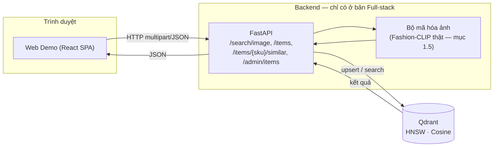
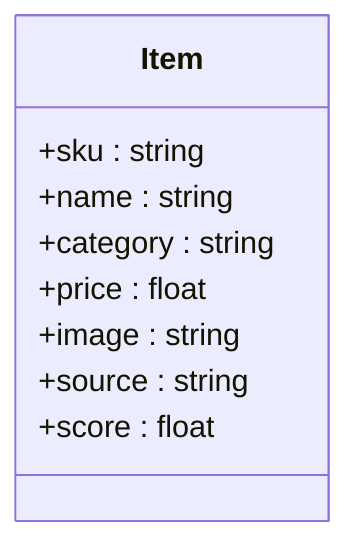
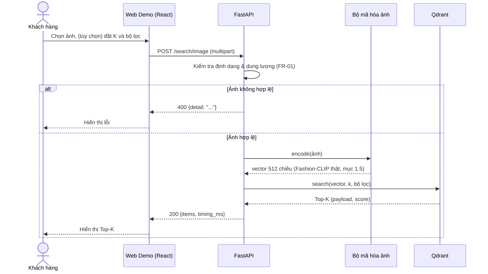
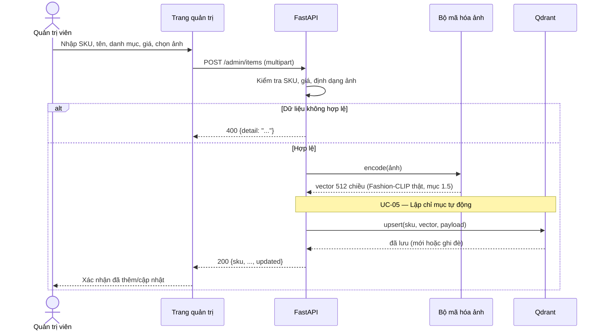

# Hệ thống Visual Search & Similar Items cho TMĐT Thời trang

**Đồ án môn Kỹ thuật phần mềm**

| Thông tin | Nội dung |
|---|---|
| Môn học | Kỹ thuật phần mềm |
| Giảng viên hướng dẫn | Trịnh Thanh Bình |
| Sinh viên thực hiện | Trần Công Thành Đạt - 23010782 |
| Mô hình phát triển | Agile cá nhân (Scrum rút gọn, iteration 1 tuần) |

Đề tài nộp thành ba phần độc lập cho ba môn học: **(1) Kỹ thuật phần mềm** (tài liệu này —
đặc tả, thiết kế, kiểm thử, rủi ro, không kèm mã nguồn); **(2) Xây dựng ứng dụng web** — React
(Vite) chạy hoàn toàn phía client, bộ mã hóa ảnh mô phỏng bằng Canvas API; **(3) Thiết kế web
nâng cao** — cùng giao diện với (2), ghép backend FastAPI + Qdrant thật, đóng gói Docker
Compose. FR/NFR, use case và ma trận truy vết dưới đây áp dụng chung cho (2) và (3), mỗi phần
chỉ hiện thực phạm vi phù hợp môn học của nó.

## I. Giới thiệu đề tài

### 1.1 Bối cảnh và vấn đề

Tìm kiếm bằng từ khóa gặp rào cản trong thời trang vì kiểu dáng, họa tiết khó mô tả bằng
ngôn ngữ. Người dùng cần tìm sản phẩm bằng ảnh thực tế hoặc ảnh từ mạng xã hội.

### 1.2 Mục tiêu

* **Sản phẩm:** hệ thống tìm kiếm bằng ảnh (**Visual Search**) và gợi ý sản phẩm tương tự
  (**Similar Items**) cho TMĐT thời trang, dùng **Fashion-CLIP** và **Qdrant Vector DB**.
* **Môn học:** áp dụng quy trình kỹ thuật phần mềm trọn vẹn — đặc tả, thiết kế UML, Agile,
  kiểm thử tự động, CI/CD, quản lý rủi ro.

### 1.3 Phạm vi

* **In-scope:** tiền xử lý tập dữ liệu Fashion Product Images (Small), RESTful API, Vector
  DB, Web Demo.
* **Out-of-scope:** giỏ hàng, thanh toán, vận chuyển, quản lý tài khoản người dùng.

### 1.4 Ràng buộc và giả định

* Làm cá nhân trong thời gian học phần → phạm vi quản lý theo MoSCoW (mục IV), chỉ **Must**
  là bắt buộc.
* Dữ liệu chính: **Fashion Product Images (Small)** (Kaggle, Param Aggarwal — ~44.100 ảnh
  thật, nhãn `articleType`/`baseColour`, tải công khai không cần xin quyền). Danh mục hiển thị
  ánh xạ từ `articleType`; giá là dữ liệu giả lập vì tập dữ liệu không có giá.
* Bộ mã hóa ảnh **chính thức** là Fashion-CLIP thật (ViT-B/32, vector 512 chiều — mục 1.5).
  Mã nguồn nộp kèm (Phần 2, 3) chạy bằng bộ mã hóa dự phòng (mô phỏng, không học máy) vì môi
  trường soạn thảo bị chặn tải PyTorch/trọng số mô hình — xem mục 1.5 và mục X.
* Bản demo học tập, chưa có xác thực người dùng; Admin thao tác qua API/giao diện nội bộ.

### 1.5 Tích hợp Fashion-CLIP thật

| Thuộc tính | Giá trị |
|---|---|
| Kiến trúc nền | CLIP ViT-B/32 (`patrickjohncyh/fashion-clip`) |
| Chiều vector embedding | 512 |
| Dữ liệu huấn luyện | ~800K sản phẩm thời trang (Farfetch) |
| Kích thước tải về | ~400–500 MB |
| Giấy phép | MIT |
| Kích thước ảnh đầu vào | 224×224 |

```python
# requirements.txt: fashion-clip, torch
from fashion_clip.fashion_clip import FashionCLIP
import numpy as np

fclip = FashionCLIP("fashion-clip")

def encode_image(pil_image) -> np.ndarray:
    vec = fclip.encode_images([pil_image], batch_size=1)[0]
    return vec / np.linalg.norm(vec)   # chuẩn hóa L2
```

Điểm tích hợp chỉ nằm ở `app/core/encoder.py` của backend Phần 3 — phần còn lại (API, Qdrant,
front-end) không cần đổi vì mọi nơi chỉ phụ thuộc hợp đồng "ảnh → vector đã chuẩn hóa L2".

Mã nguồn nộp kèm vẫn dùng bộ mã hóa dự phòng (histogram màu 64 chiều + lưới hình dáng 16
chiều + gradient 8 chiều = vector 88 chiều, chuẩn hóa L2) vì môi trường soạn thảo bị chặn
mạng, không cài được PyTorch. Đây là bản demo chạy được ngay, đã kiểm thử thật (32 test PASS,
mục IX); thay bằng lệnh gọi Fashion-CLIP ở trên là thay đổi cục bộ, tự làm trên máy có
mạng/GPU trước khi báo cáo. Vector lưu Qdrant chuyển từ 88 → 512 chiều khi tích hợp thật
(`VECTOR_DIM` trong `backend/app/config.py`).

### 1.6 Các bên liên quan

| Bên liên quan | Mối quan tâm |
|---|---|
| Khách hàng (Shopper) | Tìm đúng sản phẩm nhanh bằng ảnh, xem gợi ý tương tự |
| Quản trị viên (Admin) | Thêm/cập nhật SKU dễ dàng, dữ liệu tìm kiếm luôn đồng bộ |
| Giảng viên | Product Owner: nghiệm thu theo tiêu chí mục III–IV |
| Sinh viên thực hiện | Tự đảm nhiệm mọi vai trò |

## II. Kiến trúc tổng quan



| Thành phần | Vai trò |
|---|---|
| Web Demo | Upload ảnh, Top-K, bộ lọc giá/danh mục, trang chi tiết + "Sản phẩm tương tự", trang quản trị |
| API (FastAPI) | Kiểm tra/chuẩn hóa ảnh (FR-01), điều phối mã hóa + truy vấn |
| Bộ mã hóa ảnh | Sinh vector đặc trưng từ ảnh (mục 1.5) |
| Qdrant | Lưu vector + metadata, tìm ANN bằng HNSW, lọc theo metadata |

Ở bản Front-end, kiến trúc rút gọn còn đúng khối **Web Demo**: front-end tự đảm nhiệm vai trò
Bộ mã hóa (Canvas API) và Qdrant (tìm kiếm tuyến tính trong bộ nhớ), không có Server/Qdrant
thật.

**Mô hình dữ liệu (Item)** — khớp `schemas.py` ở bản Full-stack:



`score` chỉ có khi `Item` là kết quả tìm kiếm/gợi ý. Vector đặc trưng (512 chiều với
Fashion-CLIP thật, 88 chiều với bộ dự phòng) lưu trong Qdrant, không trả qua API.

## III. Tác nhân và Use Case

**Tác nhân:** Khách hàng, Quản trị viên, Hệ thống (Indexing).


| Mã | Use case | Tác nhân chính | FR liên quan |
|---|---|---|---|
| UC-01 | Tìm kiếm sản phẩm bằng ảnh | Khách hàng | FR-01, FR-02 |
| UC-02 | Lọc kết quả theo giá/danh mục | Khách hàng | FR-04 |
| UC-03 | Xem sản phẩm tương tự tại trang chi tiết | Khách hàng | FR-03 |
| UC-04 | Thêm/cập nhật SKU vào danh mục | Quản trị viên | FR-05 |
| UC-05 | Lập chỉ mục vector tự động | Hệ thống | FR-05 |

### UC-01 Tìm kiếm sản phẩm bằng ảnh

| Mục | Nội dung |
|---|---|
| Tiền điều kiện | Danh mục đã được lập chỉ mục |
| Luồng chính | Chọn ảnh + K (tùy chọn) → hệ thống kiểm tra định dạng/dung lượng → chuẩn hóa ảnh, tìm K sản phẩm giống nhất → hiển thị theo độ tương đồng giảm dần |
| Luồng thay thế | Ảnh sai định dạng/quá dung lượng → báo lỗi. Không có kết quả → thông báo. Có đặt bộ lọc → UC-02 |
| Hậu điều kiện | Danh sách phù hợp hoặc thông báo lỗi/không có kết quả |



### UC-04 Thêm/cập nhật SKU vào danh mục

| Mục | Nội dung |
|---|---|
| Tiền điều kiện | Truy cập được trang/API quản trị (demo, chưa xác thực — mục 1.4) |
| Luồng chính | Nhập SKU/tên/danh mục/giá + ảnh → kiểm tra dữ liệu → mã hóa ảnh → lưu/ghi đè vào Qdrant (kích hoạt UC-05) → xác nhận |
| Luồng thay thế | Dữ liệu không hợp lệ → báo lỗi, không lưu. SKU đã tồn tại → ghi đè, trả `updated = true` |
| Hậu điều kiện | Sản phẩm tìm kiếm được ngay ở lần truy vấn kế tiếp |



## IV. Yêu cầu chức năng (FR)

MoSCoW: **M** = Must, **S** = Should, **C** = Could.

| Mã | User story | FR | Ưu tiên |
|---|---|---|---|
| US-01 | Khách hàng tải ảnh một món đồ để tìm sản phẩm giống nó | FR-01, FR-02 | M |
| US-02 | Khách hàng xem sản phẩm tương tự khi đang xem một sản phẩm | FR-03 | M |
| US-03 | Admin thêm sản phẩm và tìm kiếm được ngay | FR-05 | M |
| US-04 | Khách hàng lọc kết quả theo giá và danh mục | FR-04 | S |

| Mã | Yêu cầu | Ưu tiên | Tiêu chí chấp nhận |
|---|---|---|---|
| **FR-01** Upload & Preprocessing | Upload `.jpg`/`.png`, kiểm tra định dạng, chuẩn hóa kích thước | M | Từ chối file sai định dạng/> 5 MB kèm lỗi rõ ràng; ảnh hợp lệ chuẩn hóa về 224×224 (Fashion-CLIP, mục 1.5) |
| **FR-02** Visual Search | Trả Top-K sản phẩm giống nhất | M | K mặc định 10, tối đa 50; sắp xếp giảm dần theo độ tương đồng; mỗi kết quả có SKU, tên, giá, ảnh, score |
| **FR-03** Similar Items | Sản phẩm cùng kiểu dáng tại trang chi tiết | M | Danh sách không chứa chính sản phẩm đang xem |
| **FR-04** Attribute Filtering | Kết hợp Vector Search với lọc giá/danh mục | S | Kết quả trả về thỏa bộ lọc; không khớp → danh sách rỗng |
| **FR-05** Catalog Indexing | Tự trích xuất vector khi Admin thêm SKU | M | SKU mới tìm được ngay sau khi thêm; thêm trùng SKU → cập nhật, không tạo bản sao |

## V. Yêu cầu phi chức năng (NFR)

Điều kiện đo NFR-01/03: chạy trên danh mục $100.000+$ vector, ghi rõ cấu hình phần cứng.

| Mã | Yêu cầu | Chỉ tiêu | Cách kiểm chứng |
|---|---|---|---|
| **NFR-01** Latency | Độ trễ phản hồi | API E2E $< 300\text{ms}$; vector query $< 50\text{ms}$ (Fashion-CLIP trên GPU; CPU có thể cao hơn — mục X) | Test hiệu năng, báo cáo p50/p95 |
| **NFR-02** Accuracy | Độ chính xác truy hồi | $Recall@10 \ge 80\%$ trên tập test tự tách từ Fashion Product Images (Small) (nhóm theo `articleType`, vì dataset này không có split query/gallery chuẩn như DeepFashion), đo với Fashion-CLIP thật | Script đánh giá tự tách query/gallery, mục IX |
| **NFR-03** Scalability | Khả năng mở rộng | $100.000+$ vector, $RPS \ge 50$ | Load test (Locust), bổ sung vector giả lập |
| **NFR-04** Deployability | Khả năng triển khai | Toàn bộ hệ thống chạy bằng `docker-compose up` | Triển khai thử trên máy sạch |
| **NFR-05** Maintainability | Khả năng bảo trì | Coverage $\ge 70\%$ module lõi, code qua linter | Báo cáo coverage trong CI |

## VI. Công cụ và Công nghệ sử dụng

* **AI:** Fashion-CLIP thật (`ViT-B/32`, 512 chiều — chính thức, mục 1.5); bộ mã hóa dự phòng
  88 chiều (fallback trong mã nguồn nộp kèm).
* **Dataset:** Fashion Product Images (Small) (Kaggle, Param Aggarwal, ~44.100 ảnh).
* **Backend & Storage:** Python 3.11+, FastAPI, Qdrant (chỉ mục HNSW).
* **Front-end:** React + Vite (dùng chung giữa bản độc lập và bản gọi API thật).
* **DevOps:** Docker & Docker Compose.
* **Quy trình:** Git + GitHub (Pull Request, commit theo quy ước), GitHub Projects (Kanban),
  `pytest`/`httpx`, GitHub Actions (CI), draw.io/PlantUML.

## VII. Quy trình phát triển (Agile cá nhân)

Scrum rút gọn: Product Backlog (mục IV) ưu tiên MoSCoW → Sprint Backlog hằng tuần → Review +
Retrospective vào `docs/sprint-log.md`. Product Owner là giảng viên. Definition of Done: merge
qua Pull Request, có unit test, qua CI, đáp ứng tiêu chí chấp nhận.

| Iteration | Trọng tâm |
|---|---|
| 0 | SRS, dựng repo/CI, vẽ Use Case |
| 1 | Front-end React + bộ mã hóa mô phỏng |
| 2 | Backend FastAPI + Qdrant, API Visual Search/Similar/Admin (FR-02, 03, 05); tích hợp Fashion-CLIP (mục 1.5) |
| 3 | Ghép front-end với API thật, bộ lọc (FR-04), Docker Compose |
| 4 | Đo hiệu năng/độ chính xác, hoàn thiện tài liệu, chuẩn bị bảo vệ |

## VIII. Sản phẩm bàn giao

1. Tài liệu đặc tả yêu cầu (SRS) — tài liệu này.
2. Mô hình UML: Use Case (mục III), Sequence (UC-01, UC-04), ER/Class.
3. Mã nguồn Front-end (môn Xây dựng ứng dụng web).
4. Mã nguồn Full-stack + `docker-compose.yml` (môn Thiết kế web nâng cao).
5. Kế hoạch/báo cáo kiểm thử, ma trận truy vết (mục IX).
6. Báo cáo Recall@10 và hiệu năng đo với Fashion-CLIP thật; nếu không có mạng/GPU thì báo cáo
   số liệu trên bộ mã hóa dự phòng kèm ghi chú.
7. Nhật ký dự án: backlog, sprint log, lịch sử commit/PR.
8. Slide và demo bảo vệ.

## IX. Kiểm thử và đảm bảo chất lượng

| Mức | Nội dung | Công cụ |
|---|---|---|
| Unit test | Validate ảnh, tiền xử lý, mã hóa, lọc | `pytest` |
| Integration test | API ↔ mã hóa ↔ Qdrant | `pytest`, `httpx` |
| Kiểm thử chức năng | Tiêu chí chấp nhận FR-01…FR-05 | `pytest`, thủ công |
| Kiểm thử hiệu năng | Latency p50/p95, RPS trên $100.000+$ vector | Locust |
| Đánh giá mô hình | Recall@10 trên tập test tự tách từ Fashion Product Images (Small) | Script riêng |
| Kiểm thử chấp nhận | 3–5 người dùng thử theo UC-01…UC-04 | Khảo sát ngắn |

Mọi Pull Request phải qua CI (lint + test) trước khi merge vào `main`.

**Ma trận truy vết yêu cầu** (cột "Kiểm thử" trích tên test thật trong `backend/tests/` của
bản Full-stack; **"đã chạy: PASS"** = đã thực thi thật, không chỉ viết sẵn):

| Yêu cầu | User story | Use case | Kiểm thử |
|---|---|---|---|
| FR-01 | US-01 | UC-01 | `ValidateTests` (8 test) — `test_core.py`, **đã chạy: PASS** |
| FR-02 | US-01 | UC-01 | `SearchTests.test_top_k_orders_by_similarity`, `test_k_caps_result_count` — **đã chạy: PASS** |
| FR-03 | US-02 | UC-03 | `SearchTests.test_exclude_sku` — **đã chạy: PASS** |
| FR-04 | US-04 | UC-02 | `SearchTests.test_category_filter`, `test_price_range_filter` — **đã chạy: PASS** |
| FR-05 | US-03 | UC-04, UC-05 | `MemoryStoreTests.test_upsert_then_get`, `test_upsert_twice_reports_updated` — **đã chạy: PASS** |
| NFR-01, 03 | — | — | Locust — chưa thực hiện (mục X) |
| NFR-02 | — | — | Script Recall@10 — chưa chạy được trong môi trường soạn thảo (mục X) |
| NFR-04 | — | — | `docker-compose.yml` viết sẵn — build/chạy thật cần tự thực hiện |
| NFR-05 | — | — | 32/32 test `test_core.py` **PASS**; `ruff check --select=F,E9` sạch |

`test_api.py` (HTTP thật qua `TestClient`) đã viết đầy đủ nhưng chưa chạy được ở môi trường
soạn thảo (thiếu `fastapi`) — chạy `pip install -r requirements.txt` rồi
`pytest tests/test_api.py` trên máy có mạng trước khi báo cáo kết quả cuối.

## X. Quản lý rủi ro

| Rủi ro | Mức độ | Biện pháp giảm thiểu |
|---|---|---|
| Làm một mình, dễ quá tải/trễ tiến độ | Cao | Chốt MVP gồm yêu cầu Must; theo dõi tiến độ hằng tuần |
| Mã nguồn nộp kèm dùng bộ mã hóa dự phòng, chưa phải Fashion-CLIP thật | Cao | Điểm tích hợp đã tách rõ (mục 1.5); tự cài đặt và đo lại NFR-01/02 trên máy có mạng/GPU trước khi báo cáo |
| Fashion Product Images (Small) chỉ ~44.100 ảnh, chưa đủ $100.000+$ vector cho NFR-03 | Trung bình | Bổ sung vector giả lập để load test, nêu rõ trong báo cáo |
| Dataset không có split query/gallery chuẩn cho retrieval (khác DeepFashion) | Trung bình | Tự tách test theo `articleType`; ghi rõ phương pháp để Recall@10 không bị hiểu nhầm là so sánh trực tiếp với DeepFashion |
| Chưa xác nhận rõ license của dataset trên Kaggle | Thấp | Ghi nguồn/tác giả trong báo cáo, chỉ dùng phi thương mại, kiểm tra lại trước khi nộp |
| Môi trường soạn thảo bị chặn mạng, không tải được Fashion-CLIP thật | Cao | Mã nguồn nộp kèm vẫn chạy đầy đủ bằng bộ mã hóa dự phòng; điểm cắm Fashion-CLIP đã tách rõ (mục 1.5) |
| Thiếu GPU khi chạy Fashion-CLIP thật | Trung bình | Mã hóa theo lô, lưu lại vector; không có GPU thì đo và báo cáo độ trễ thật trên CPU |
| Mất mã nguồn/dữ liệu | Thấp | Đẩy code lên GitHub thường xuyên; sao lưu vector đã mã hóa |

## XI. Phân công

| Vai trò | Người phụ trách |
|---|---|
| Toàn bộ (Product Owner, phân tích, thiết kế, lập trình, kiểm thử) | _(điền họ tên, MSSV)_ — làm cá nhân |

## XII. Tài liệu tham khảo

* Chia, P.J. et al. (2022). *Contrastive language and vision learning of general fashion
  concepts.* Scientific Reports — bài báo gốc Fashion-CLIP (`patrickjohncyh/fashion-clip`).
* Aggarwal, P. *Fashion Product Images (Small).* Kaggle Dataset —
  <https://www.kaggle.com/datasets/paramaggarwal/fashion-product-images-small>.
* Malkov, Y., Yashunin, D. (2018). *Efficient and Robust Approximate Nearest Neighbor Search
  Using Hierarchical Navigable Small World Graphs.* IEEE TPAMI — thuật toán HNSW.
* Qdrant documentation. <https://qdrant.tech/documentation/>
* FastAPI documentation. <https://fastapi.tiangolo.com/>
* React documentation. <https://react.dev/>
